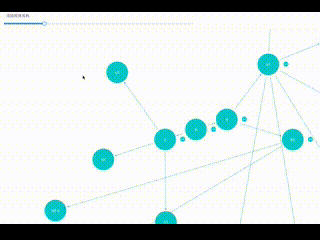
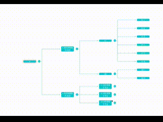
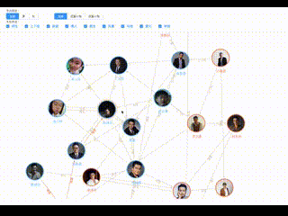
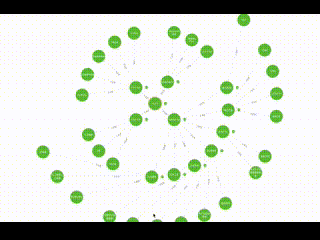

# relation-graph


[English ](README.md) | [简体中文](README-zh.md)

- **relation-graph** 是支持Vue2、Vue3、React的关系数据展示组件，支持通过【插槽】让使用者使用"普通HTML元素、Vue组件、React组件"来完全自定义图形元素，并提供实用的API接口让使用者轻松构建可交互的图形应用。<br />
-  除了典型的关系数据展示功能，relation-graph还支持作为一个画板来使用，你可以在画板上放置任何内容，只需要为想要连接的元素设置id，同时定义"元素连线（Element Lines）"即可。轻松实现一个可任意创建连线、可缩放与拖动、支持通过API轻松实现动态交互的画板。
### Docs & Examples  文档 & 示例：

- [https://relation-graph.com](https://relation-graph.com)  （国内用户，无需科学上网）

上面的网站中包含使用文档、在线示例，以及可视化的配置工具。<br>

### Getting Started  快速使用：

```shell script
npm install --save relation-graph
```
```shell script
# 注意：relation-graph支持Vue2、Vue3、React, 引入的包名称都是"relation-graph" 但在使用时，根据你的环境，需要引入不同的名称
# Note: relation-graph supports Vue2, Vue3, React, but the package name for import is always "relation-graph".
# 
# Vue2： import RelationGraph from 'relation-graph'
# Vue3： import RelationGraph from 'relation-graph/vue3'
# React： import RelationGraph from 'relation-graph/react'
```

```vue
<template>
  <div>
    <div style="height:calc(100vh - 60px);"><!-- The size of the parent element determines the size of the graph. -->
      <RelationGraph
              ref="graphRef"
              :options="graphOptions"
              :on-node-click="onNodeClick"
              :on-line-click="onLineClick"
      />
    </div>
  </div>
</template>

<script>
// relation-graph also supports usage in the main.js file with Vue.use(RelationGraph); this way, you don't need the following line of code for import.
import RelationGraph from 'relation-graph'
export default {
  name: 'Demo',
  components: { RelationGraph },
  data() {
    return {
      graphOptions: {
        defaultJunctionPoint: 'border'
        // Here you can refer to the options in "Graph" for setting: 
        // https://www.relation-graph.com/#/docs/graph
        // You can also use this GUI tool to generate configuration content.
        // https://www.relation-graph.com/#/options-tools
      }
    }
  },
  mounted() {
    this.showGraph()
  },
  methods: {
    showGraph() {
      const jsonData = {
        rootId: 'a',
        nodes: [
          // You can also use slots directly without defining these cumbersome attributes and use CSS styles to define the appearance of your nodes.
          // Example of using slots: https://www.relation-graph.com/#/demo/node-style
          { id: 'a', text: 'A', borderColor: 'yellow' },
          { id: 'b', text: 'B', color: '#43a2f1', fontColor: 'yellow' },
          { id: 'c', text: 'C', nodeShape: 1, width: 80, height: 60 },
          { id: 'e', text: 'E', nodeShape: 0, width: 150, height: 150 }
        ],
        lines: [
          { from: 'a', to: 'b', text: 'line1', color: '#43a2f1' },
          { from: 'a', to: 'c', text: 'line2' },
          { from: 'a', to: 'e', text: 'line3' },
          { from: 'b', to: 'e', color: '#67C23A' }
        ]
      }
      // The node and line in the above data can refer to the options in "Node" and "Link & Line" for configuration.
      // Node: https://www.relation-graph.com/#/docs/node
      // Link & Line: https://www.relation-graph.com/#/docs/link

      this.$refs.graphRef.setJsonData(jsonData, (graphInstance) => {
        // Called when the relation-graph is completed
      });
      // The this.refs.graphRef.setJsonData(jsonData, callback) method is a convenient method that is equivalent to the following code:
      //  const graphInstance = this.refs.graphRef.getInstance();
      //  graphInstance.addNodes(jsonData.nodes);
      //  graphInstance.addLines(jsonData.lines);
      //  graphInstance.rootNode = graphInstance.getNodeById(jsonData.rootId);
      //  await graphInstance.doLayout(); // Layout using the layouter set in graphOptions
      //  await graphInstance.moveToCenter(); // Find the center based on node distribution and center the view
      //  await graphInstance.zoomToFit(); // Zoom to fit, so that all nodes can be displayed in the visible area
    },
    onNodeClick(nodeObject, $event) {
      console.log('onNodeClick:', nodeObject)
    },
    onLineClick(lineObject, $event) {
      console.log('onLineClick:', lineObject)
    }
  }
}
</script>
```


### Sample code effects  上面代码的效果：


### Example Projects  完整的示例代码：

- Vue3完整小示例:
- https://github.com/seeksdream/relation-graph-vue3-demo

- React完整小示例:
- https://github.com/seeksdream/relation-graph-react-demo

- vue2完整小示例:
- https://github.com/seeksdream/relation-graph-vue2-demo


### More Examples   更多示例：
- [https://relation-graph.com/#/demo](https://relation-graph.com/#/demo)  （国内用户，无需科学上网）











### 完整的、可运行的示例项目：

- Vue2完整小示例：
- [https://github.com/seeksdream/relation-graph-vue2-demo(Vite)](https://github.com/seeksdream/relation-graph-vue2-demo)
- [https://github.com/seeksdream/relation-graph-vue2-demo(Webpack)](https://github.com/seeksdream/relation-graph-webpack)

- Vue3完整小示例：
- https://github.com/seeksdream/relation-graph-vue3-demo

- React完整小示例：
- https://github.com/seeksdream/relation-graph-react-demo


### More info  更多效果及使用方法：

- [https://relation-graph.com](https://relation-graph.com)  （国内用户，无需科学上网）

### Contact me  与我联系：

- 我的QQ：3235808353
- My WhatsApp:

  

