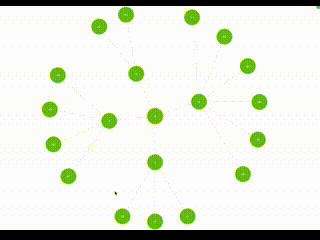

# relation-graph

[English ](README.md) | [简体中文](README-zh.md)

- **relation-graph** is a relationship data display component that supports Vue 2, Vue 3, and React. It enables users to fully customize graphical elements using "common HTML elements, Vue components, React components" through slots, and provides practical API interfaces to facilitate the development of interactive graphical applications."<br />
-  In addition to the typical relationship data display functionality, the relation-graph also supports being used as a drawing board. You can place any content on the drawing board, simply by setting an id for the elements you want to connect, and defining "element lines." This allows for the easy creation of a drawing board that supports the creation of arbitrary connections, zooming and dragging, and dynamic interactions through the API.
### Docs & Examples 

- [https://relation-graph.com](https://relation-graph.com) 

The website above includes documentation, online demos, and a visual configuration tool for software developers.

### Getting Started

```shell script
# Vue2
npm install --save relation-graph
# Vue3
npm install --save relation-graph-vue3
# React
npm install --save relation-graph-react
```
```shell script
# Vue2： import RelationGraph from 'relation-graph'
# Vue3： import RelationGraph from 'relation-graph-vue3'
# React： import RelationGraph from 'relation-graph-react'
```

```vue
<template>
  <div>
    <div style="height:calc(100vh - 60px);"><!-- The size of the parent element determines the size of the graph. -->
      <RelationGraph
              ref="graphRef"
              :options="graphOptions"
              :on-node-click="onNodeClick"
              :on-line-click="onLineClick"
      />
    </div>
  </div>
</template>

<script>
// relation-graph also supports usage in the main.js file with Vue.use(RelationGraph); this way, you don't need the following line of code for import.
import RelationGraph from 'relation-graph'
export default {
  name: 'Demo',
  components: { RelationGraph },
  data() {
    return {
      graphOptions: {
        defaultJunctionPoint: 'border'
        // Here you can refer to the options in "Graph" for setting: 
        // https://www.relation-graph.com/#/docs/graph
        // You can also use this GUI tool to generate configuration content.
        // https://www.relation-graph.com/#/options-tools
      }
    }
  },
  mounted() {
    this.showGraph()
  },
  methods: {
    showGraph() {
      const jsonData = {
        rootId: 'a',
        nodes: [
          // You can also use slots directly without defining these cumbersome attributes and use CSS styles to define the appearance of your nodes.
          // Example of using slots: https://www.relation-graph.com/#/demo/node-style
          { id: 'a', text: 'A', borderColor: 'yellow' },
          { id: 'b', text: 'B', color: '#43a2f1', fontColor: 'yellow' },
          { id: 'c', text: 'C', nodeShape: 1, width: 80, height: 60 },
          { id: 'e', text: 'E', nodeShape: 0, width: 150, height: 150 }
        ],
        lines: [
          { from: 'a', to: 'b', text: 'line1', color: '#43a2f1' },
          { from: 'a', to: 'c', text: 'line2' },
          { from: 'a', to: 'e', text: 'line3' },
          { from: 'b', to: 'e', color: '#67C23A' }
        ]
      }
      // The node and line in the above data can refer to the options in "Node" and "Link & Line" for configuration.
      // Node: https://www.relation-graph.com/#/docs/node
      // Link & Line: https://www.relation-graph.com/#/docs/link

      this.$refs.graphRef.setJsonData(jsonData, (graphInstance) => {
        // Called when the relation-graph is completed
      });
      // The this.refs.graphRef.setJsonData(jsonData, callback) method is a convenient method that is equivalent to the following code:
      //  const graphInstance = this.refs.graphRef.getInstance();
      //  graphInstance.addNodes(jsonData.nodes);
      //  graphInstance.addLines(jsonData.lines);
      //  graphInstance.rootNode = graphInstance.getNodeById(jsonData.rootId);
      //  await graphInstance.doLayout(); // Layout using the layouter set in graphOptions
      //  await graphInstance.moveToCenter(); // Find the center based on node distribution and center the view
      //  await graphInstance.zoomToFit(); // Zoom to fit, so that all nodes can be displayed in the visible area
    },
    onNodeClick(nodeObject, $event) {
      console.log('onNodeClick:', nodeObject)
    },
    onLineClick(lineObject, $event) {
      console.log('onLineClick:', lineObject)
    }
  }
}
</script>
```


### Sample code effects


### Example Projects

- The complete Vue2 sample project:
- https://github.com/seeksdream/relation-graph-vue3-demo

- The complete Vue3 sample project:
- https://github.com/seeksdream/relation-graph-react-demo

- The complete React sample project:
- https://github.com/seeksdream/relation-graph-vue2-demo


### More Examples
- [https://relation-graph.com/#/demo](https://relation-graph.com/#/demo)




### The complete sample project

- The complete Vue2 sample project：
- [https://github.com/seeksdream/relation-graph-vue2-demo(Vite)](https://github.com/seeksdream/relation-graph-vue2-demo)
- [https://github.com/seeksdream/relation-graph-vue2-demo(Webpack)](https://github.com/seeksdream/relation-graph-webpack)

- The complete Vue3 sample project：
- https://github.com/seeksdream/relation-graph-vue3-demo

- The complete React sample project：
- https://github.com/seeksdream/relation-graph-react-demo


### More info

- [https://relation-graph.com](https://relation-graph.com)


### Contact me

- My WhatsApp:

  

- QQ：3235808353

